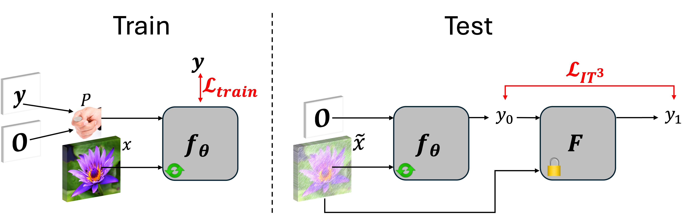

# $IT^3$: Idempotent Test-Time Training

<p align="center">
  
</p>

**Idempotent Test-Time Training ($IT^3$) approach:** During training (left), the model $f_{\theta}$ is trained to predict the label $\mathbf{y}$ with or without $\mathbf{y}$ given to it as input. At test time (right), when given a corrupted input, the model is sequentially applied. It then briefly trains with the objective of making $f_{\theta}(\mathbf{x},\cdot)$ to be idempotent using only the current test input.

[](https://arxiv.org/abs/2403.16732)
[](https://www.python.org/downloads/release/python-31014/)
[](https://pytorch.org/)
[](https://github.com/cvlab-epfl/iter_unc/blob/main/LICENSE)

### [Project Page](https://www.norange.io/projects/ittt/) | [arXiv Paper](https://arxiv.org/abs/2410.04201)

> **For a quick tryout of the method, check the Colab notebooks below!**

> **Please also refer to the [Zigzag](https://github.com/cvlab-epfl/zigzag) paper, which served as the foundation for our work.**

## Abstract

This paper introduces *Idempotent Test-Time Training* ($IT^3$), a novel approach to addressing the challenge of distribution shift. While supervised-learning methods assume matching train and test distributions, this is rarely the case for machine learning systems deployed in the real world. Test-Time Training (TTT) approaches address this by adapting models during inference, but they are limited by a domain specific auxiliary task. $IT^3$ is based on the universal property of idempotence. An idempotent operator is one that can be applied sequentially without changing the result beyond the initial application, that is $f(f(\mathbf{x}))=f(\mathbf{x})$. At training, the model receives an input $\mathbf{x}$ along with another signal that can either be the ground truth label $\mathbf{y}$ or a neutral "don't know" signal $\mathbf{0}$. At test time, the additional signal can only be $\mathbf{0}$. When sequentially applying the model, first predicting $\mathbf{y}_0 = f(\mathbf{x}, \mathbf{0})$ and then $\mathbf{y}_1 = f(\mathbf{x}, \mathbf{y}_0)$, the distance between $\mathbf{y}_0$ and $\mathbf{y}_1$ measures certainty and indicates out-of-distribution input $\mathbf{x}$ if high. We use this distance, that can be expressed as $||f(\mathbf{x}, f(\mathbf{x}, \mathbf{0})) - f(\mathbf{x}, \mathbf{0})||$ as our TTT loss during inference. By carefully optimizing this objective, we effectively train $f(\mathbf{x},\cdot)$ to be idempotent, projecting the internal representation of the input onto the training distribution. We demonstrate the versatility of our approach across various tasks, including corrupted image classification, aerodynamic predictions, tabular data with missing information, age prediction from face, and large-scale aerial photo segmentation. Moreover, these tasks span different architectures such as MLPs, CNNs, and GNNs.

## Experiments

Coming soon...

## Citation

If you find this code useful, please consider citing our paper:

> Durasov, Nikita, et al. "IT$\^3$: Idempotent Test-Time Training." arXiv 2024.

```bibtex
@article{durasov2024ittt,
    title = {IT $\^{} 3$: Idempotent Test-Time Training},
    author = {Durasov, Nikita and Shocher, Assaf and Oner, Doruk and Chechik, Gal and Efros, Alexei A and Fua, Pascal},
    journal = {arXiv preprint arXiv:2410.04201},
    year = {2024}
}
``` 
